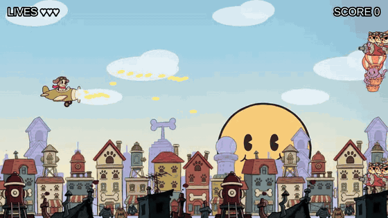
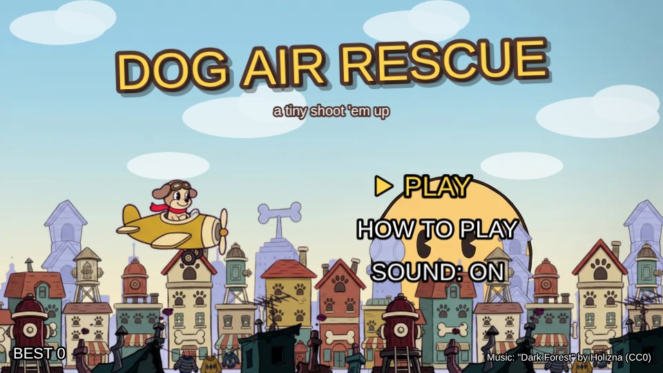

# 🐶✈️ Dog Air Rescue

A small side-scrolling shoot 'em up made with **Phaser 3** and **Vite**. The cats of the city stole the puppies — fly in and get them back.



## Controls

| Action | Keys |
|---|---|
| Move | Arrows / WASD |
| Shoot | Hold X or Space (you aim up while climbing and down while diving) |
| Mute | M |
| Retry / Menu | R / Esc |

## Features

- **4 enemy types with their own behaviors**: a balloon cat that weaves across the screen, a gunner that stops to aim at you, a kamikaze that telegraphs and dives, and a heavy blimp that fires in a spread.
- **Wave system** with formations (line, column, V, random). When the last wave ends, the list repeats with more HP, speed and fire rate.
- **Game feel**: hit-stop, screen shake, particles, score popups, muzzle flash and a punchy HUD.
- **Synthesized sound effects** (Web Audio, no audio files) and streamed background music.
- **Parallax background** with four layers.
- Main menu, controls screen and a best score saved locally.



## Technical highlights

- **Object pooling everywhere.** Bullets, enemies, enemy bullets, explosions and score popups are created once and pre-warmed when the level loads, so nothing is allocated or destroyed during play.
- **Data-driven design.** Waves (`src/config/waves.js`), enemy types (`enemyTypes.js`), player skins (`skins.js`) and tuning values (`constants.js`) are plain config objects. Designing a level means editing data, not code.
- **One enemy class, many behaviors.** All enemy types share a single class and pool. Each type plugs in a behavior (`src/entities/enemyBehaviors.js`), a small state machine with `spawn` and `update`.
- **Decoupled systems.** Entities emit events, the HUD only listens to the registry, and visual/audio feedback lives in `Effects`, so gameplay code never has to know how a hit should look or sound.
- **Streaming music.** The soundtrack plays through an `<audio>` element instead of being fully decoded by Web Audio, which would take ~160 MB of RAM for a 7-minute track.

## Asset pipeline

The art was generated as sprite sheets on a flat magenta background and processed with small Node scripts (using [sharp](https://sharp.pixelplumbing.com/)):

```
AI sprite sheet ──► npm run slice ──► individual frames ──► npm run atlas ──► compressed texture atlas
background art  ──► npm run parallax ──► seamless WebP layers
```

- **`slice`** removes the magenta background (chroma key plus despill), splits the sheet into frames and aligns them on the character's body so animations don't jitter. A *connected components* mode handles sheets where effects such as muzzle flashes spill into the neighboring cell.
- **`atlas`** trims transparent space, packs the frames and quantizes the PNG to 256 colors. All 28 enemy frames fit in a single ~105 KB atlas.
- **`parallax`** keys out each layer, finds two matching columns to make it tile seamlessly (cutting between buildings where possible) and exports WebP. The four layers total 170 KB.

## Project structure

```
src/
├── config/     tuning, skins, enemy types and wave design
├── entities/   player, enemies and their behaviors, bullets, explosions
├── scenes/     Boot → Menu → Game (+ UI running on top)
└── systems/    waves, effects, sound, music, parallax, storage
tools/          asset pipeline scripts
art/source/     original art used by the pipeline
```

## Run it locally

```bash
npm install
npm run dev
```

Build for production with `npm run build` (output in `dist/`).

## Credits

- Music: **"Dark Forest" by Holizna** (CC0)
- Sound effects: synthesized in code
- Character, enemy and background art: AI-generated, then processed with the tools above
- Code: Juan Camilo Hernández Nisperuza
